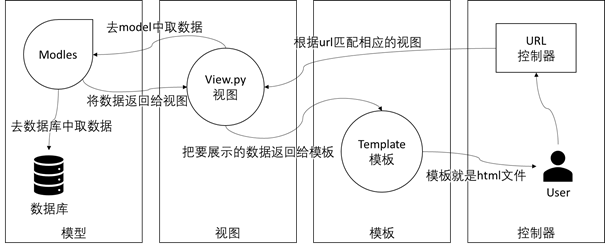

# 相关开发框架及工具

## [Django](https://www.djangoproject.com/)

Django 是一种基于Python语言的具有完整架站能力的开源网络框架，并且提供了完善的开发与测试文档以及API。

Django是一个MVT模式的框架，本质就是一个MVC的框架，不过通过DRF可以构建RESTful API来搭建前后端分离的项目。_（即抛弃Django中的模板，转而用前端来代替，其次Django只用来提供数据，大部分的业务逻辑由前端来实现。）_

## [Django REST Framework](https://www.django-rest-framework.org/)

## Django Channels/WebSocket

## [Vue](https://cn.vuejs.org/)

Vue是一个基于Node.js的前端开发框架，它是由中国开发者尤雨溪开发的一套响应式的前端框架（此处的响应式不是指针对屏幕的响应，而是面向数据的响应）。Vue.js与目前市场比较流行的PLOYMER、REACT和ANGULAR相比较，使用量、选择率最高的还是Vue.js框架。

## [AntDesign](https://vue.ant.design/)（Vue版）

阿里巴巴团队开发的基于Vue的前端UI组件，懒人的选择。

当然Vue的UI组件有很多如element-ui等等，都是可以使用的。

